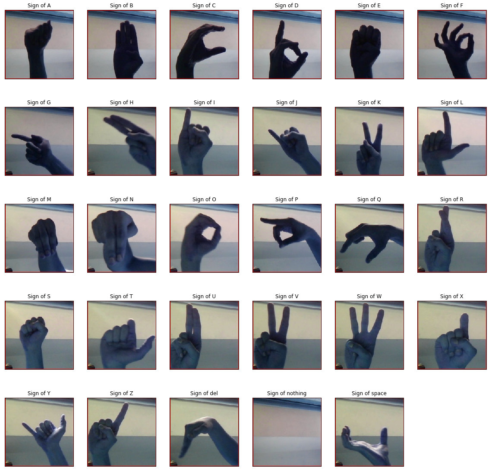
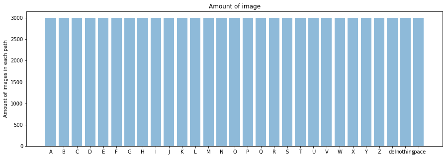
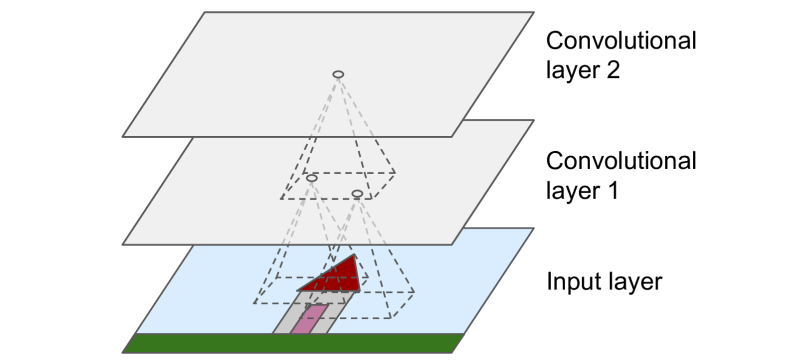
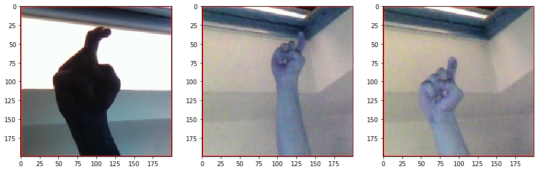
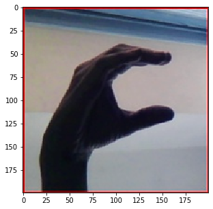

# Machine Learning Engineer Nanodegree
## Capstone Project
João Pedro Conte Sobrinho

July 5st, 2019

## I. Definition
This project it's about a deep learning method more specifically of computer vision where we use this concept to understand and generate a model which will interpret the American Sign Language (ASL) for use in futures occasion to real time translate this language to speaking language.

As we already speak, the ASL is an important method of communication for deaf community in United States and in part of Canada. It's a very complex visual-spatial language, where all movements it's important and represents something [1].

Very colleges and universities are beginning recognize the ASL as a cultural and important language to study [2]. Nevertheless we have a large quantity of people which not have knowledge of this language and sometimes think it's a mimicry or thing in this kind, but it's not. 

Like was said in first paragraph the mainly idea of this project is create a recognition system for ASL, however for all language it would being very hard get the data, so with the ASL letters' database found in Kaggle could solve the problem.

Was found some problems in the way, but this will be discussed over this report.

### Project Overview
This project involve concepts about deep learning, or to be more specific this project it will using the computer vision to understand and classification the simple gestures using to communication of American Sign Language.

This problem surged when we saw the big number of people at deaf community that need comunicate and the big number of peoples which not know about ASL and can't comunicate with the deaf community, isolating them of the majority population. 

To using the concepts of deep learning will need much datas and this datas it's available on Kaggle platform, that a platform of competitions and practices of machine and deep learning.

Basicaly the concept of the project it will br use this datas to create a good model to recognition of the gestures of ASL. This model it's based on idea which suppose that if the people can undertand a gesture of ASL the computer can understand too.

How to evaluate the model and how the model it's understand the images will be explained forward.

<!--In this section, look to provide a high-level overview of the project in layman’s terms. Questions to ask yourself when writing this section:
- _Has an overview of the project been provided, such as the problem domain, project origin, and related datasets or input data?_
- _Has enough background information been given so that an uninformed reader would understand the problem domain and following problem statement?_-->

### Problem Statement
As was said in the proposal, the mainly problem of this project is the recognition and the image processing, this problem will required the concepts of deep learning which can be learn this on extracurricular part of nanodegree. This concepts of neural networks, image processing, and other are treated in this part of course and this generate a good base for solve the problem.

Basicaly it will be use a library to create the neural network, and after it the datas are pass to this library and it will helping to create the model based on concepts of NN.

Explaining quickly we will pass the datas from the library which will create a convolutional neural network (CNN) model, this type of neural network it's good to analyze images because it will seen only the mainly parts of the figure, like it's ilustrate in image below.


In lay terms, ehat is illustrated in the image is a CNN where we have the convolutional layers which are layers where it's extract the parts with more relevance in the image and after it the CNN transform the final image generate in the vector which is pass to the NN fully connect that it will generate the model. The image was extract from [this blog post](https://towardsdatascience.com/a-comprehensive-guide-to-convolutional-neural-networks-the-eli5-way-3bd2b1164a53).

<!--In this section, you will want to clearly define the problem that you are trying to solve, including the strategy (outline of tasks) you will use to achieve the desired solution. You should also thoroughly discuss what the intended solution will be for this problem. Questions to ask yourself when writing this section:
- _Is the problem statement clearly defined? Will the reader understand what you are expecting to solve?_
- _Have you thoroughly discussed how you will attempt to solve the problem?_
- _Is an anticipated solution clearly defined? Will the reader understand what results you are looking for?_-->

### Metrics
In the used library has some metrics which can be used to measure performance of a model and like defined in the library itself a metric is a function that is used to judge the performance of the model.

With this when the model is compiled the metrics are define and in this case the metric that was use it's accuracy. Like can be see in this part of the code:

```python
model.compile(optimizer='adam', loss='categorical_crossentropy', metrics=["accuracy"])
```
Basically the metrics of the model are calculate in all iteration and return the accuracy of the model. It's important to emphasize that the accuracy it's not use to train the model, only to say th accuracy it's good or not, for this model the good accuracy is greater or equal than 80%.

The input of the metrics method is the predictions label and the output is a single tensor value representing the mean of the output array across all datapoints. The accuracy is categorical because have more than one data of output. 

<!--In this section, you will need to clearly define the metrics or calculations you will use to measure performance of a model or result in your project. These calculations and metrics should be justified based on the characteristics of the problem and problem domain. Questions to ask yourself when writing this section:
- _Are the metrics you’ve chosen to measure the performance of your models clearly discussed and defined?_
- _Have you provided reasonable justification for the metrics chosen based on the problem and solution?_-->


## II. Analysis
<!--_(approx. 2-4 pages)_-->
In this section let's see more closely the analysis of the datas, exploring the dataset and the algorithm that was used.

### Data Exploration
As was said in the proposal, the database of images of ASL Alphabet is a database of images of American Sign Language, where have a group of images containing the letters of ASL.

This dataset was lifted up in the Kaggle, basically the Kaggle is a website where we have many datasets that can use in personal projects to train or in conpetitions in platform itself.

The images of dataset compose 87,000 images with 200x200 pixels, and this images was divided in 29 classes, of which 26 are for the letters A-Z, and the others 3 are for the SPACE, DELETE and NOTHING, and this classes are for very helpful in real time application, which are very useful in this application. Below, we can see a example of the ASL Alphabet.


You can find the dataset [click on this link](https://www.kaggle.com/grassknoted/asl-alphabet) [3].

As was said the dataset composed of 87,000 images and all images have the same size. To each image we have a train dataset with 3,000 images, or in other words each letter or word have 3,000 images to train. Could increase dataset create more images, but as the library used have this option of generate data it was not necessary.

<!--In this section, you will be expected to analyze the data you are using for the problem. This data can either be in the form of a dataset (or datasets), input data (or input files), or even an environment. The type of data should be thoroughly described and, if possible, have basic statistics and information presented (such as discussion of input features or defining characteristics about the input or environment). Any abnormalities or interesting qualities about the data that may need to be addressed have been identified (such as features that need to be transformed or the possibility of outliers). Questions to ask yourself when writing this section:
- _If a dataset is present for this problem, have you thoroughly discussed certain features about the dataset? Has a data sample been provided to the reader?_
- _If a dataset is present for this problem, are statistics about the dataset calculated and reported? Have any relevant results from this calculation been discussed?_
- _If a dataset is **not** present for this problem, has discussion been made about the input space or input data for your problem?_
- _Are there any abnormalities or characteristics about the input space or dataset that need to be addressed? (categorical variables, missing values, outliers, etc.)_-->

### Exploratory Visualization
The exploration and visualization of the data was did in notebook in Jupyter and can be seen below:

Let's start import the libraries which will be used for processing, import and visualization of dataset.

```python
import numpy as np
import matplotlib.pyplot as plt
import random, cv2, os, re
```
Now will seen the number of classes and the classes itself with this we can see the number of classes is 29, like as expected, and each classes as said before.

```python
path = '../dados/'
list_path = sorted(os.listdir(path))
number_classes = len(list_path)

print("Amount of data: "+str(number_classes))
print("Classes of data: "+str(list_path))
```

    Amount of data: 29
    Classes of data: ['A', 'B', 'C', 'D', 'E', 'F', 'G', 'H', 'I', 'J', 'K', 'L', 'M', 'N', 'O', 'P', 'Q', 'R', 'S', 'T', 'U', 'V', 'W', 'X', 'Y', 'Z', 'del', 'nothing', 'space']

Here let's plot some data for visualization.

```python
def plot():
    plt.figure(figsize = (20, 20))
    
    for i in range(1, 30):
        imgs = path + list_path[i-1] + '/' + list_path[i-1] +'1.jpg'
        plt.subplot(5, 6, i)
        plt.imshow(cv2.imread(imgs))
        plt.title("Sign of "+str(list_path[i-1]))
        plt.xticks([])
        plt.yticks([])
plot()
```


and here we will get the number of datas in each path.

```python
number_in_list = []

for i in list_path:
    image_path = path + i
    letter = os.listdir(image_path)
    number_images = len(letter)
    number_in_list.append(number_images)
    
number_in_list = np.array(number_in_list)
```

finally, let's plot it:

```python
plt.figure(figsize = (15, 5))
plt.bar(list_path, number_in_list, align='center', alpha=0.5)
plt.ylabel("Amount of images in each path")
plt.title('Amount of image')
```



This notebook can be seen [click on this link](https://github.com/lejoaoconte/Machine-Learning-Nanodegree-Udacity-Capstone-Project/blob/master/notebooks/explorer_Of_Datas.ipynb).

<!--In this section, you will need to provide some form of visualization that summarizes or extracts a relevant characteristic or feature about the data. The visualization should adequately support the data being used. Discuss why this visualization was chosen and how it is relevant. Questions to ask yourself when writing this section:
- _Have you visualized a relevant characteristic or feature about the dataset or input data?_
- _Is the visualization thoroughly analyzed and discussed?_
- _If a plot is provided, are the axes, title, and datum clearly defined?_-->

### Algorithms and Techniques
The algorithm that was used don't have any special characteristic, it's a simple algorithm which is used to do a neural network with the libraries and specific APIs. The concepts of programming that's used are struct and object orientation programming.

So as was said the neural network used is the convolutional neural network. This type of neural network analyse the main points of the image, this concept emerge from the idea of brain's visual cortex.

Define the concept of convolution layer like the book of Géron [3]: the convolutional layer is the most important building block of a CNN, the neurons in the first convolutional layer are not connected to every single pixel in the input image, but only to pixels in their receptive fields like the image bellow (image from book [3]).



In turn, each neuron in the second convolutional layer is connected only to neurons located within a small rectangle in the first layer. This architecture allows the network to concentrate on small low-level features in the first hidden layer, then assemble them into larger higher-level features in the next hidden layer, and so on. This hierarchical structure is common in real-world images, which is one of the reasons why CNNs work so well for image recognition.[3]

With this, the input of CNN are the images and the output, for this case, is a vector with 29 positions, where each position represents a value of the image that will pass to the model ate the predict letter or not.

<!--In this section, you will need to discuss the algorithms and techniques you intend to use for solving the problem. You should justify the use of each one based on the characteristics of the problem and the problem domain. Questions to ask yourself when writing this section:
- _Are the algorithms you will use, including any default variables/parameters in the project clearly defined?_
- _Are the techniques to be used thoroughly discussed and justified?_
- _Is it made clear how the input data or datasets will be handled by the algorithms and techniques chosen?_-->

### Benchmark
In the simple analyse which was did in other kernels on the Kaggle [3] it was seen that the classifications have accuracy on average of 80% using others arquetectures of CNN. That's all using the same dataset.

<!--In this section, you will need to provide a clearly defined benchmark result or threshold for comparing across performances obtained by your solution. The reasoning behind the benchmark (in the case where it is not an established result) should be discussed. Questions to ask yourself when writing this section:
- _Has some result or value been provided that acts as a benchmark for measuring performance?_
- _Is it clear how this result or value was obtained (whether by data or by hypothesis)?_-->


## III. Methodology
<!--_(approx. 3-5 pages)_-->

### Data Preprocessing


<!--In this section, all of your preprocessing steps will need to be clearly documented, if any were necessary. From the previous section, any of the abnormalities or characteristics that you identified about the dataset will be addressed and corrected here. Questions to ask yourself when writing this section:
- _If the algorithms chosen require preprocessing steps like feature selection or feature transformations, have they been properly documented?_
- _Based on the **Data Exploration** section, if there were abnormalities or characteristics that needed to be addressed, have they been properly corrected?_
- _If no preprocessing is needed, has it been made clear why?_-->

### Implementation
The implementation can be seen bellow.

Importing libraries

```python
#Linear algebra and data processing
import numpy as np
import pandas as pd

# Imports for Deep Learning
import keras
import tensorflow as tf
from tensorflow.keras.layers import Conv2D, Dense, Dropout, Flatten, MaxPooling2D
from tensorflow.keras.models import Sequential
from tensorflow.keras.preprocessing.image import ImageDataGenerator

#Import plots and import datas
import matplotlib.pyplot as plt
import random, cv2, os
from keras.preprocessing import image
```
    Using TensorFlow backend.

Define parameters that will used

```python
path = '../dados/' # Path where contain datas
list_path = os.listdir(path) # Paths of datas
number_classes = len(list_path) # Amount of datas
target_size = (64, 64) # Size of images
target_dims = (64, 64, 3) # Size of images with channel
val_frac = 0.2 # Value that will dividing in training and testing datas
batch_size = 32 # Batch size
```
Plot some datas, just to see

```python
# Function where plot the datas
def plot(l):
    print("Letters of path " + l) # Letter that will plot 
    img_path = path + l + '/' # Path of letter
    contents = os.listdir(img_path) # Get contents of path
    plt.figure(figsize=(15, 15)) # Define a figure 
    imgs = random.sample(contents, 3) # Get 3 random datas
    
    #For to plot the 3 images
    for i in range(len(imgs)):
        img = img_path + imgs[i]
        number = int('13'+str(1+i))
        plt.subplot(number)
        plt.imshow(cv2.imread(img))
    return

plot('X') # Calling function with letter 'X'
```
    Letters of path X



#### Define NN model

In first layer we have 64 filters, passing (3, 3) in image and activation function is relu function, which can be seen bellow. After it we have a pooling layer with (2, 2) pool size and a dropout of 10% of datas. This goes on in the next layers, but in second and third layer we have 128 filters and in fourth we have 128 filters.

After we have a simple NN with 128, 128, 256 and 256 units per layer and, finally, the output layer with 29 units, or the number of classes which will are classified.

To finish we have the compile, already discuss before.

```python
model = Sequential()
model.add(Conv2D(64, (3, 3), input_shape = target_dims, activation = 'relu')) #First layer
model.add(MaxPooling2D(pool_size = (2, 2))) # First pooling
model.add(Dropout(0.1)) # Dropout

model.add(Conv2D(128, (3, 3), activation = 'relu'))
model.add(MaxPooling2D(pool_size = (2, 2)))
model.add(Dropout(0.1))

model.add(Conv2D(128, (3, 3), activation = 'relu'))
model.add(MaxPooling2D(pool_size = (2, 2)))
model.add(Dropout(0.1))

model.add(Conv2D(256, (3, 3), activation = 'relu')) 
model.add(MaxPooling2D(pool_size = (2, 2)))

model.add(Flatten())

model.add(Dense(units = 128, activation = 'relu'))
model.add(Dense(units = 128, activation = 'relu'))
model.add(Dense(units = 256, activation = 'relu'))
model.add(Dense(units = 256, activation = 'relu'))
model.add(Dense(units = number_classes, activation = 'softmax'))

model.compile(optimizer = 'adam', loss = 'categorical_crossentropy', metrics = ['accuracy'])

model.summary()
```

    Model: "sequential"
    _________________________________________________________________
    Layer (type)                 Output Shape              Param #   
    =================================================================
    conv2d (Conv2D)              (None, 62, 62, 64)        1792      
    _________________________________________________________________
    max_pooling2d (MaxPooling2D) (None, 31, 31, 64)        0         
    _________________________________________________________________
    dropout (Dropout)            (None, 31, 31, 64)        0         
    _________________________________________________________________
    conv2d_1 (Conv2D)            (None, 29, 29, 128)       73856     
    _________________________________________________________________
    max_pooling2d_1 (MaxPooling2 (None, 14, 14, 128)       0         
    _________________________________________________________________
    dropout_1 (Dropout)          (None, 14, 14, 128)       0         
    _________________________________________________________________
    conv2d_2 (Conv2D)            (None, 12, 12, 128)       147584    
    _________________________________________________________________
    max_pooling2d_2 (MaxPooling2 (None, 6, 6, 128)         0         
    _________________________________________________________________
    dropout_2 (Dropout)          (None, 6, 6, 128)         0         
    _________________________________________________________________
    conv2d_3 (Conv2D)            (None, 4, 4, 256)         295168    
    _________________________________________________________________
    max_pooling2d_3 (MaxPooling2 (None, 2, 2, 256)         0         
    _________________________________________________________________
    flatten (Flatten)            (None, 1024)              0         
    _________________________________________________________________
    dense (Dense)                (None, 128)               131200    
    _________________________________________________________________
    dense_1 (Dense)              (None, 128)               16512     
    _________________________________________________________________
    dense_2 (Dense)              (None, 256)               33024     
    _________________________________________________________________
    dense_3 (Dense)              (None, 256)               65792     
    _________________________________________________________________
    dense_4 (Dense)              (None, 29)                7453      
    =================================================================
    Total params: 772,381
    Trainable params: 772,381
    Non-trainable params: 0
    _________________________________________________________________

Data generator of Keras, define by the library itself: ImageDataGenerator class will generate batches of tensor image data with real-time data augmentation. The data will be looped over (in batches).

In this case it's not use the many other resources of ImageDataGenerator like:
- featurewise_center: Boolean. Set input mean to 0 over the dataset, feature-wise.
- samplewise_center: Boolean. Set each sample mean to 0.
- featurewise_std_normalization: Boolean. Divide inputs by std of the dataset, feature-wise.
- samplewise_std_normalization: Boolean. Divide each input by its std.
- zca_epsilon: epsilon for ZCA whitening. Default is 1e-6.
- zca_whitening: Boolean. Apply ZCA whitening.
- rotation_range: Int. Degree range for random rotations.

and others, because it was understood that it's not necessary.


```python
datagen = ImageDataGenerator(rescale = 1./255, # rescale the values of image in 0 until 1
                             validation_split = val_frac) #apply the split
```

```python
# Importing datas with ImageDataGenerator

train = datagen.flow_from_directory(path,
                                    target_size = target_size,
                                    batch_size = batch_size,
                                    shuffle = True,
                                    subset = "training")

valid = datagen.flow_from_directory(path,
                                    target_size = target_size,
                                    batch_size = batch_size,
                                    subset = "validation")
```

    Found 69600 images belonging to 29 classes.
    Found 17400 images belonging to 29 classes.

Define some more parameters, the steps per epoch it's good be amount of data divide by batch size, but for optimize the processing we divide this value by 5 too.

```python
steps_per_epoch = (69600 // batch_size)//5
print('Steps per epoch: '+str(steps_per_epoch))
epochs = 30
validation_steps = 25
```

    Steps per epoch: 435

Training the NN

```python
model.fit_generator(train,
                    epochs = epochs,
                    steps_per_epoch = steps_per_epoch,
                    validation_data = valid,
                    validation_steps = validation_steps)
```

    Epoch 1/30

    WARNING: Logging before flag parsing goes to stderr.
    W0715 09:04:35.908107 140460448835392 deprecation.py:323] From /usr/local/lib/python3.6/dist-packages/tensorflow/python/ops/math_grad.py:1250: add_dispatch_support.<locals>.wrapper (from tensorflow.python.ops.array_ops) is deprecated and will be removed in a future version.
    Instructions for updating:
    Use tf.where in 2.0, which has the same broadcast rule as np.where


    435/435 [==============================] - 103s 236ms/step - loss: 3.0670 - accuracy: 0.0924 - val_loss: 2.4900 - val_accuracy: 0.2313
    Epoch 2/30
    435/435 [==============================] - 89s 203ms/step - loss: 1.2248 - accuracy: 0.5718 - val_loss: 1.2953 - val_accuracy: 0.6175
    Epoch 3/30
    435/435 [==============================] - 89s 204ms/step - loss: 0.5077 - accuracy: 0.8164 - val_loss: 1.0750 - val_accuracy: 0.6875
    Epoch 4/30
    435/435 [==============================] - 89s 204ms/step - loss: 0.3016 - accuracy: 0.8950 - val_loss: 0.9163 - val_accuracy: 0.7575
    Epoch 5/30
    435/435 [==============================] - 89s 204ms/step - loss: 0.2255 - accuracy: 0.9235 - val_loss: 0.7906 - 
    .
    .
    .
    Epoch 30/30
    435/435 [==============================] - 89s 206ms/step - loss: 0.0540 - accuracy: 0.9869 - val_loss: 1.0354 - val_accuracy: 0.8150

    <tensorflow.python.keras.callbacks.History at 0x7fbef41f0a58>

Define some parameters to test

```python
path_test = '../dados_test/'
list_path = os.listdir(path_test)
```
Function that return the letter predicted.

```python
def alpha(argument):
    switcher = {
        0: "A",
        1: "B",
        2: "C",
        3: "D",
        4: "del",
        5: "E",
        6: "F",
        7: "G",
        8: "H",
        9: "I",
        10: "J",
        11: "K",
        12: "L",
        13: "M",
        14: "N",
        15: "nothing",
        16: "O",
        17: "P",
        18: "Q",
        19: "R",
        20: "S",
        21: "space",
        22: "T",
        23: "U",
        24: "V",
        25: "W",
        26: "X",
        27: "Y",
        28: "Z"
    }
    return switcher.get(argument, "Invalid value")
```

Testing

```python
result = [] # Define a vector of results
l = list_path[20].split("_")[0] # Get one letter of test path
print("Letters of path " + l) # The letter

plt.figure(figsize=(5, 5)) # Define figure
img = path_test + list_path[20] # Get image to plot
plt.imshow(cv2.imread(img)) # Plotting image

test_image = image.load_img(img, target_size=(64, 64)) # Load image to predict
test_image = image.img_to_array(test_image) # Convert image to array
test_image = np.expand_dims(test_image, axis=0) #Expand the dimension of image

pred = model.predict_on_batch(test_image) # Make prediction
result.append(pred) # Get values

result = np.asarray(result) # Define the vector of result as array
imprime = np.array(result[0][0]) # Call the function of letter

print(alpha(imprime.argmax())) # Print the result
```

    Letters of path C
    C



Save the model and weights

```python
model_json = model.to_json()
with open('model_json.json', 'w') as json_file:
    json_file.write(model_json)
model.save_weights('model_h5.h5')
```

<!--In this section, the process for which metrics, algorithms, and techniques that you implemented for the given data will need to be clearly documented. It should be abundantly clear how the implementation was carried out, and discussion should be made regarding any complications that occurred during this process. Questions to ask yourself when writing this section:
- _Is it made clear how the algorithms and techniques were implemented with the given datasets or input data?_
- _Were there any complications with the original metrics or techniques that required changing prior to acquiring a solution?_
- _Was there any part of the coding process (e.g., writing complicated functions) that should be documented?_-->

### Refinement


<!--In this section, you will need to discuss the process of improvement you made upon the algorithms and techniques you used in your implementation. For example, adjusting parameters for certain models to acquire improved solutions would fall under the refinement category. Your initial and final solutions should be reported, as well as any significant intermediate results as necessary. Questions to ask yourself when writing this section:
- _Has an initial solution been found and clearly reported?_
- _Is the process of improvement clearly documented, such as what techniques were used?_
- _Are intermediate and final solutions clearly reported as the process is improved?_-->


## IV. Results
<!--_(approx. 2-3 pages)_-->

### Model Evaluation and Validation


<!--In this section, the final model and any supporting qualities should be evaluated in detail. It should be clear how the final model was derived and why this model was chosen. In addition, some type of analysis should be used to validate the robustness of this model and its solution, such as manipulating the input data or environment to see how the model’s solution is affected (this is called sensitivity analysis). Questions to ask yourself when writing this section:
- _Is the final model reasonable and aligning with solution expectations? Are the final parameters of the model appropriate?_
- _Has the final model been tested with various inputs to evaluate whether the model generalizes well to unseen data?_
- _Is the model robust enough for the problem? Do small perturbations (changes) in training data or the input space greatly affect the results?_
- _Can results found from the model be trusted?_-->

### Justification


<!--In this section, your model’s final solution and its results should be compared to the benchmark you established earlier in the project using some type of statistical analysis. You should also justify whether these results and the solution are significant enough to have solved the problem posed in the project. Questions to ask yourself when writing this section:
- _Are the final results found stronger than the benchmark result reported earlier?_
- _Have you thoroughly analyzed and discussed the final solution?_
- _Is the final solution significant enough to have solved the problem?_-->


## V. Conclusion
<!--_(approx. 1-2 pages)_-->

### Free-Form Visualization


<!--In this section, you will need to provide some form of visualization that emphasizes an important quality about the project. It is much more free-form, but should reasonably support a significant result or characteristic about the problem that you want to discuss. Questions to ask yourself when writing this section:
- _Have you visualized a relevant or important quality about the problem, dataset, input data, or results?_
- _Is the visualization thoroughly analyzed and discussed?_
- _If a plot is provided, are the axes, title, and datum clearly defined?_-->

### Reflection


<!--In this section, you will summarize the entire end-to-end problem solution and discuss one or two particular aspects of the project you found interesting or difficult. You are expected to reflect on the project as a whole to show that you have a firm understanding of the entire process employed in your work. Questions to ask yourself when writing this section:
- _Have you thoroughly summarized the entire process you used for this project?_
- _Were there any interesting aspects of the project?_
- _Were there any difficult aspects of the project?_
- _Does the final model and solution fit your expectations for the problem, and should it be used in a general setting to solve these types of problems?_-->

### Improvement

## VI. Bibliography References

[1] About American Sign Language – Deaf Resorce Library
http://www.deaflibrary.org/asl.html

[2] ASL as a Foreign Language Fact Sheet – University of New Mexico
http://www.unm.edu/~wilcox/UNM/facts.html

[3] Kaggle Dataset of ASL Alphabet
https://www.kaggle.com/grassknoted/asl-alphabet

[4] Hands-On Machine Learning with Scikit-Learn & Tensorflow, Aurélien Géron. First edition, O'Reilly.

<!--In this section, you will need to provide discussion as to how one aspect of the implementation you designed could be improved. As an example, consider ways your implementation can be made more general, and what would need to be modified. You do not need to make this improvement, but the potential solutions resulting from these changes are considered and compared/contrasted to your current solution. Questions to ask yourself when writing this section:
- _Are there further improvements that could be made on the algorithms or techniques you used in this project?_
- _Were there algorithms or techniques you researched that you did not know how to implement, but would consider using if you knew how?_
- _If you used your final solution as the new benchmark, do you think an even better solution exists?_-->

 -----------

<!-- **Before submitting, ask yourself. . .** -->

<!-- - Does the project report you’ve written follow a well-organized structure similar to that of the project template?
- Is each section (particularly **Analysis** and **Methodology**) written in a clear, concise and specific fashion? Are there any ambiguous terms or phrases that need clarification?
- Would the intended audience of your project be able to understand your analysis, methods, and results?
- Have you properly proof-read your project report to assure there are minimal grammatical and spelling mistakes?
- Are all the resources used for this project correctly cited and referenced?
- Is the code that implements your solution easily readable and properly commented?
- Does the code execute without error and produce results similar to those reported? -->
